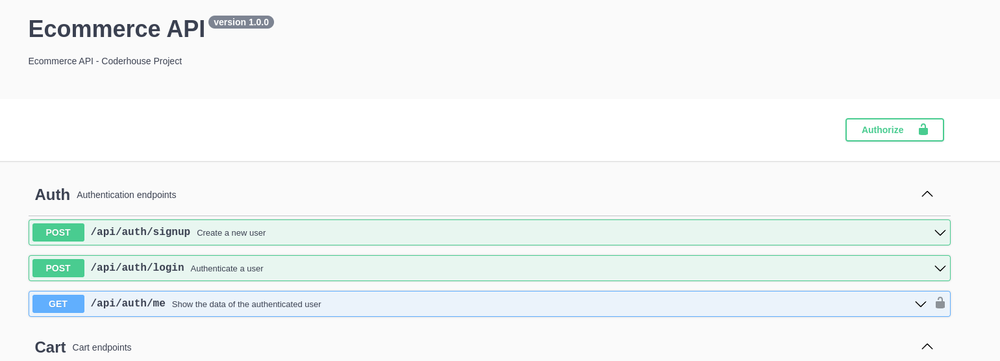
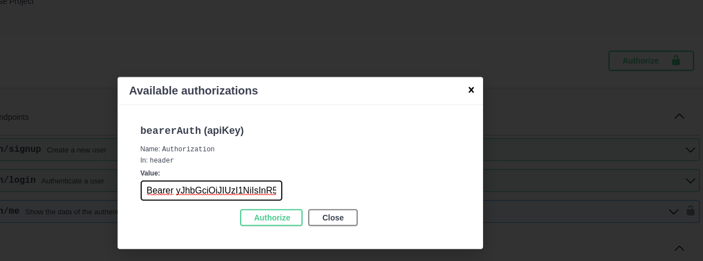

# ecommerce-backend
API REST para un Ecommerce. Proyecto final del curso de programación backend de Coderhouse.
#### La arquitectura del proyecto está ligeramente basada en la [Bulletproof Node.js architecture](https://softwareontheroad.com/ideal-nodejs-project-structure/?utm_source=github&utm_medium=readme) 🛡️

## Ver Deploy en [Railway](https://github.com/retaLazyCodes/guia-commits)

## Ver [Guía de commits](https://github.com/retaLazyCodes/guia-commits) utilizada

## Requisitos para correr el proyecto de forma local
- Tener NPM y Node.js instalado
- Tener GIT instalado
- Tener MongoDB instalado o cuenta de MongoDB Atlas

## Como instalar e iniciar el proyecto

### 1 - Clonar el repositorio

Desde la terminal ingresando:

```
git clone https://github.com/retaLazyCodes/ecommerce-backend
```

### 2 - Instalación de dependencias

Con la terminal posicionada dentro de la carpeta raíz del proyecto, ejecutar el siguiente comando

```
npm install
```

### 3 - Iniciar el servidor

- Se deberá crear un archivo con el nombre `.env` dentro de la carpeta raíz del proyecto.
- El archivo `.env` debe tener las variables definidas en el archivo `.env.example`.


- Con la terminal posicionada en la  carpeta raíz del proyecto correr el comando
```
npm run dev
```
para ejecutar el servidor en modo desarrollo. 
Y para ejecutar en modo productivo:
```
npm start
```
Luego ingresar en su navegador a la url http://localhost:8080/api-docs/

#### Ejemplo de uso de Auth Token


